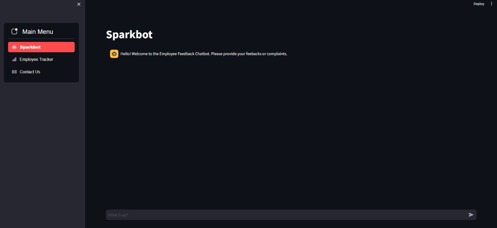
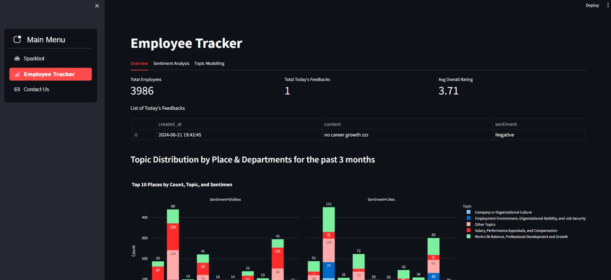

# Employee-Opinion-Tracker

![Python version][python-version]
![Latest version][latest-version]
[![GitHub forks][fork-image]][fork-url]
[![GitHub Stars][stars-image]][stars-url]
[![License][license-image]][license-url]


Employee Opinion Tracker is a comprehensive aimed at understanding organizational climate through the analysis of employee opinions. By leveraging sentiment analysis and topic modeling techniques, this project provides valuable insights into the workplace environment. The results are presented through an interactive Streamlit dashboard, making it easy to visualize and interpret the data.


To use streamlit_app_openai_chatbot.py you need to insert your OPENAI_API_KEY in ./.streamlit/secrets.toml

## Tree Structure

```zsh
├── .conda
├── .streamlit
├── __pycache_
├── data_preprocessing
│   └── Text Cleaning & Normalization_Ali.ipynb
├── dataset
│   ├── Capgemini_Employee_Reviews_from_AmbitionBox.csv
│   └── data_employee_topic.csv
├── eda
│   └── EDA_Empl_Opinion_Tracker_r2.ipynb
├── sentiment_analysis
│   ├── preprocessing_capegini.xlsx
│   ├── sentiment analysis.ipynb
│   └── sentiment_evaluation_metrics.xlsx
├── style
│   └── style.css
├── topic_modeling
│   ├── Capgemini_Employee_Reviews_Topics.csv
│   ├── final_xgboost_sg_tuned.joblib
│   ├── topic_modeling_capgemini_notebook.ipynb
│   └── word2vec_sg.bin
├── user_employee_feedbacks
│   ├── user_employee_feedbacks.json
│   └── user_feedback.csv
├── .gitignore
├── LICENSE
├── README.md
├── SPARK - Employee Opinion Tracker.pdf
├── bert_sentiment.py
├── data_preprocessing.py
├── inferencing.py
├── logs.log
├── requirements.txt
├── Result_1.jpeg
├── Result_2.jpeg
├── streamlit_app.py
└── streamlit_app_openai_chatbot.py
```

## Deployment

Deployment currently in local using Streamlit only. I have included two screenshoots how the Streamlit Dashboard looks like:



and



## License

Distributed under the terms of the [MIT](https://opensource.org/licenses/MIT) license, "Employee-Sentiment-Tracker" is free and open source software.

## Issues

If you encounter any problems, please [file an issue](https://github.com/Efradgalio/President-Election-Sentiment-Analysis/issues) along with a detailed description.

[python-version]:https://img.shields.io/badge/python-3.11.9-brightgreen.svg
[latest-version]:https://img.shields.io/badge/version-1.0.0-blue.svg
[fork-image]:https://img.shields.io/github/forks/Efradgalio/Employee-Sentiment-Tracker
[fork-url]:https://github.com/Efradgalio/Employee-Sentiment-Tracker/network
[stars-image]:https://img.shields.io/github/stars/Efradgalio/Employee-Sentiment-Tracker
[stars-url]:https://github.com/Efradgalio/Employee-Sentiment-Tracker/stargazers
[license-image]:https://img.shields.io/github/license/Efradgalio/Employee-Sentiment-Tracker
[license-url]:https://github.com/Efradgalio/Employee-Sentiment-Tracker/blob/main/LICENSE